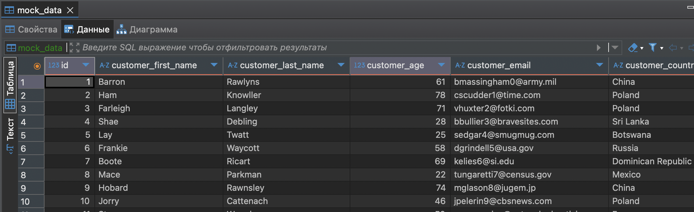
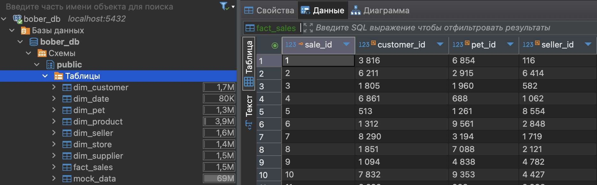
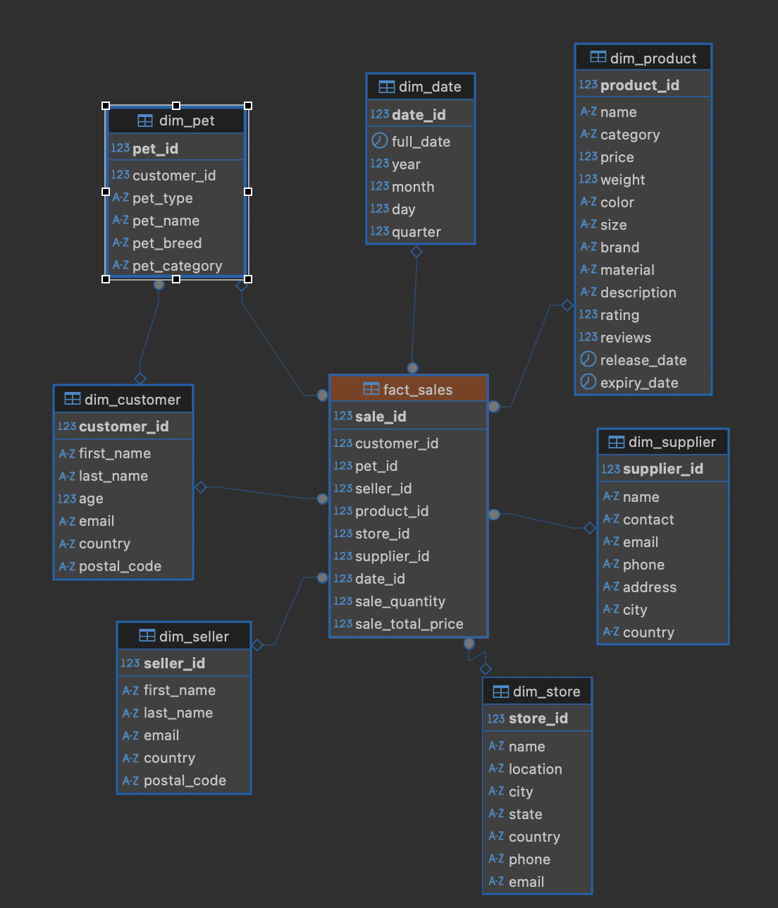

# Отчет о выполненной работе - `BigDataSnowflake`

## 1. Загрузка `*.csv` файлов в БД.

В файле [main.ipynb](./main.ipynb) приведен запуск докера и создание таблицы `mock_data` из `*.csv` файлов.



## 2. На основании анализа данных реализуем скрипты DDL для создания таблиц фактов и измерений.

Создание таблиц измерений и фактов - [файл](./sql/run_ddl.sql)

```sql
-- ===============================
-- DDL для модели данных Snowflake
-- ===============================

-- Удаляем таблицы, если уже существуют (для повторного запуска)
DROP TABLE IF EXISTS fact_sales CASCADE;
DROP TABLE IF EXISTS dim_customer CASCADE;
DROP TABLE IF EXISTS dim_pet CASCADE;
DROP TABLE IF EXISTS dim_seller CASCADE;
DROP TABLE IF EXISTS dim_product CASCADE;
DROP TABLE IF EXISTS dim_store CASCADE;
DROP TABLE IF EXISTS dim_supplier CASCADE;
DROP TABLE IF EXISTS dim_date CASCADE;

-- =====================================
-- Таблицы измерений (Dimensions)
-- =====================================

-- Клиенты
CREATE TABLE dim_customer (
    customer_id SERIAL PRIMARY KEY,
    first_name VARCHAR(100),
    last_name VARCHAR(100),
    age INT,
    email VARCHAR(255),
    country VARCHAR(100),
    postal_code VARCHAR(20)
);

-- Домашние питомцы клиентов
CREATE TABLE dim_pet (
    pet_id SERIAL PRIMARY KEY,
    customer_id INT REFERENCES dim_customer(customer_id),
    pet_type VARCHAR(100),
    pet_name VARCHAR(100),
    pet_breed VARCHAR(100),
    pet_category VARCHAR(100)
);

-- Продавцы
CREATE TABLE dim_seller (
    seller_id SERIAL PRIMARY KEY,
    first_name VARCHAR(100),
    last_name VARCHAR(100),
    email VARCHAR(255),
    country VARCHAR(100),
    postal_code VARCHAR(20)
);

-- Товары
CREATE TABLE dim_product (
    product_id SERIAL PRIMARY KEY,
    name VARCHAR(255),
    category VARCHAR(100),
    price NUMERIC(10,2),
    weight NUMERIC(10,2),
    color VARCHAR(50),
    size VARCHAR(50),
    brand VARCHAR(100),
    material VARCHAR(100),
    description TEXT,
    rating NUMERIC(3,2),
    reviews INT,
    release_date DATE,
    expiry_date DATE
);

-- Магазины
CREATE TABLE dim_store (
    store_id SERIAL PRIMARY KEY,
    name VARCHAR(255),
    location VARCHAR(255),
    city VARCHAR(100),
    state VARCHAR(100),
    country VARCHAR(100),
    phone VARCHAR(50),
    email VARCHAR(255)
);

-- Поставщики
CREATE TABLE dim_supplier (
    supplier_id SERIAL PRIMARY KEY,
    name VARCHAR(255),
    contact VARCHAR(255),
    email VARCHAR(255),
    phone VARCHAR(50),
    address VARCHAR(255),
    city VARCHAR(100),
    country VARCHAR(100)
);

-- Даты
CREATE TABLE dim_date (
    date_id SERIAL PRIMARY KEY,
    full_date DATE,
    year INT,
    month INT,
    day INT,
    quarter INT
);


-- =====================================
-- Таблица фактов (Fact)
-- =====================================

CREATE TABLE fact_sales (
    sale_id SERIAL PRIMARY KEY,
    customer_id INT REFERENCES dim_customer(customer_id),
    pet_id INT REFERENCES dim_pet(pet_id),
    seller_id INT REFERENCES dim_seller(seller_id),
    product_id INT REFERENCES dim_product(product_id),
    store_id INT REFERENCES dim_store(store_id),
    supplier_id INT REFERENCES dim_supplier(supplier_id),
    date_id INT REFERENCES dim_date(date_id),
    sale_quantity INT,
    sale_total_price NUMERIC(10,2)
);

-- Индексы для ускорения аналитических запросов
CREATE INDEX idx_fact_sales_date ON fact_sales(date_id);
CREATE INDEX idx_fact_sales_product ON fact_sales(product_id);
CREATE INDEX idx_fact_sales_customer ON fact_sales(customer_id);
CREATE INDEX idx_customer_email ON dim_customer(email);
CREATE INDEX idx_pet_customer_name ON dim_pet(customer_id, pet_name);
CREATE INDEX idx_seller_email ON dim_seller(email);
CREATE INDEX idx_product_name ON dim_product(name);
CREATE INDEX idx_store_name ON dim_store(name);
CREATE INDEX idx_supplier_name ON dim_supplier(name);
CREATE INDEX idx_date_full_date ON dim_date(full_date);
```

## 3. Заполнение таблиц измерений и фактов с помощью DML скриптов.

Заполнение измерений 

*файл [тут](./sql/run_dml_1.sql)*

```sql
-- ===============================
-- Заполняет таблицы измерений из таблицы mock_data
-- ===============================

INSERT INTO dim_customer (first_name, last_name, age, email, country, postal_code)
SELECT DISTINCT
    customer_first_name,
    customer_last_name,
    customer_age,
    customer_email,
    customer_country,
    customer_postal_code
FROM mock_data md 
WHERE customer_email IS NOT NULL;

INSERT INTO dim_pet (customer_id, pet_type, pet_name, pet_breed, pet_category)
SELECT DISTINCT
    c.customer_id,
    r.customer_pet_type,
    r.customer_pet_name,
    r.customer_pet_breed,
    r.pet_category
FROM mock_data r
JOIN dim_customer c
  ON r.customer_email = c.email;

INSERT INTO dim_seller (first_name, last_name, email, country, postal_code)
SELECT DISTINCT
    seller_first_name,
    seller_last_name,
    seller_email,
    seller_country,
    seller_postal_code
FROM mock_data;


INSERT INTO dim_product (
    name, category, price, weight, color, size, brand, material, description, rating, reviews, release_date, expiry_date
)
SELECT DISTINCT
    product_name,
    product_category,
    product_price,
    product_weight,
    product_color,
    product_size,
    product_brand,
    product_material,
    product_description,
    product_rating,
    product_reviews,
    TO_DATE(NULLIF(product_release_date, ''), 'MM/DD/YYYY'),
    TO_DATE(NULLIF(product_expiry_date, ''), 'MM/DD/YYYY')
FROM mock_data;

INSERT INTO dim_store (name, location, city, state, country, phone, email)
SELECT DISTINCT
    store_name,
    store_location,
    store_city,
    store_state,
    store_country,
    store_phone,
    store_email
FROM mock_data;

INSERT INTO dim_supplier (name, contact, email, phone, address, city, country)
SELECT DISTINCT
    supplier_name,
    supplier_contact,
    supplier_email,
    supplier_phone,
    supplier_address,
    supplier_city,
    supplier_country
FROM mock_data;

INSERT INTO dim_date (full_date, year, month, day, quarter)
SELECT DISTINCT
    TO_DATE(NULLIF(sale_date, ''), 'MM/DD/YYYY'),
    EXTRACT(YEAR FROM TO_DATE(NULLIF(sale_date, ''), 'MM/DD/YYYY')),
    EXTRACT(MONTH FROM TO_DATE(NULLIF(sale_date, ''), 'MM/DD/YYYY')),
    EXTRACT(DAY FROM TO_DATE(NULLIF(sale_date, ''), 'MM/DD/YYYY')),
    EXTRACT(QUARTER FROM TO_DATE(NULLIF(sale_date, ''), 'MM/DD/YYYY'))
FROM mock_data;
```

Расширение исходной таблицы для заполнения таблиц фактов

*файл [тут](./sql/run_dml_2.sql)*

```sql
-- ===============================
-- Расширим таблицу mock_data для подготовки данных к загрузке в таблицу фактов
-- ===============================

-- 1. Преобразуем дату в тип DATE
ALTER TABLE mock_data ADD COLUMN sale_date_parsed DATE;
UPDATE mock_data
SET sale_date_parsed = TO_DATE(NULLIF(sale_date, ''), 'MM/DD/YYYY');

-- 2. Получаем ID клиентов
ALTER TABLE mock_data ADD COLUMN customer_id INT;
UPDATE mock_data r
SET customer_id = c.customer_id
FROM dim_customer c
WHERE r.customer_email = c.email;

-- 3. Получаем ID питомца (можно NULL)
ALTER TABLE mock_data ADD COLUMN pet_id INT;
UPDATE mock_data r
SET pet_id = p.pet_id
FROM dim_pet p
WHERE r.customer_id = p.customer_id
  AND r.customer_pet_name = p.pet_name;

-- 4. ID продавца
ALTER TABLE mock_data ADD COLUMN seller_id INT;
UPDATE mock_data r
SET seller_id = s.seller_id
FROM dim_seller s
WHERE r.seller_email = s.email;

-- 5. ID продукта
ALTER TABLE mock_data ADD COLUMN product_id INT;
UPDATE mock_data r
SET product_id = pr.product_id
FROM dim_product pr
WHERE r.product_name = pr.name;

-- 6. ID магазина
ALTER TABLE mock_data ADD COLUMN store_id INT;
UPDATE mock_data r
SET store_id = st.store_id
FROM dim_store st
WHERE r.store_name = st.name;

-- 7. ID поставщика
ALTER TABLE mock_data ADD COLUMN supplier_id INT;
UPDATE mock_data r
SET supplier_id = sp.supplier_id
FROM dim_supplier sp
WHERE r.supplier_name = sp.name;

-- 8. ID даты
ALTER TABLE mock_data ADD COLUMN date_id INT;
UPDATE mock_data r
SET date_id = d.date_id
FROM dim_date d
WHERE r.sale_date_parsed = d.full_date;

-- Наконец, заполним таблицу фактов
INSERT INTO fact_sales (
    customer_id, pet_id, seller_id, product_id, store_id, supplier_id, date_id, sale_quantity, sale_total_price
)
SELECT
    customer_id,
    pet_id,
    seller_id,
    product_id,
    store_id,
    supplier_id,
    date_id,
    sale_quantity,
    sale_total_price
FROM mock_data
WHERE customer_id IS NOT NULL
  AND seller_id IS NOT NULL
  AND product_id IS NOT NULL
  AND store_id IS NOT NULL
  AND supplier_id IS NOT NULL
  AND date_id IS NOT NULL;
```

## 4. Итог полученной структуры




