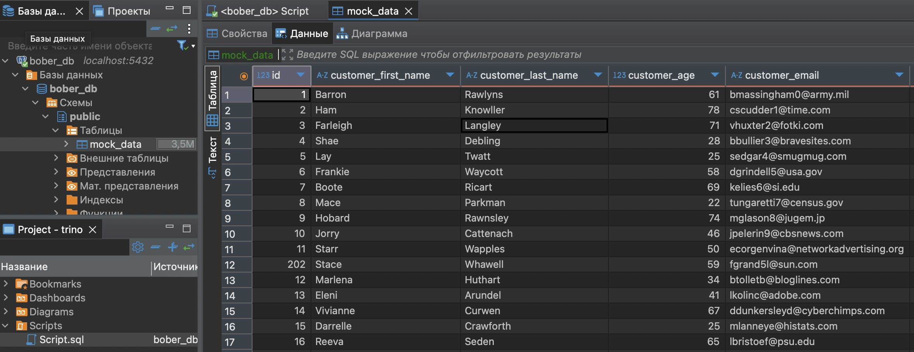
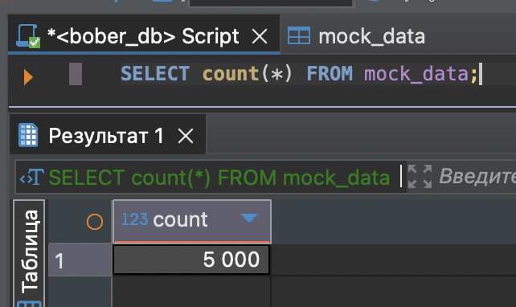
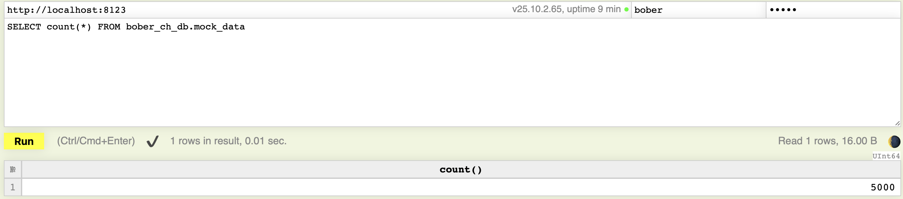
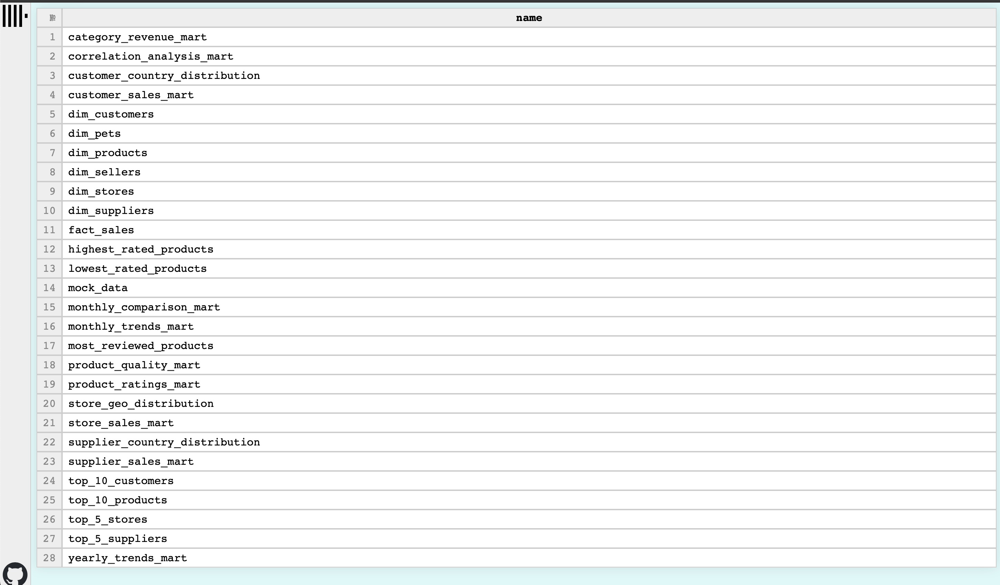

# Лабораторная работа №4 - Trino

## Цель работы

Поработать с инструментом `Trino`

## Ход работы

### 1. Postgres

Проверка загрузки данных



Посчитаем кол-во строк, которые получились

```sql
SELECT count(*) FROM mock_data;
```

Получаем `5к` строк, ровно половина из всех файлов.



✅ Данные успешно загружены!

### 2. ClickHouse

Проверим состояние загрузки в ClickHouse



✅ Как видно, остальные `5k` строк успешно загружены!



### 3. Trino

Запуск скриптов

```bash
docker exec -it trino_service /bin/bash -c 'trino --server http://localhost:8080 -f "/scripts/snowflake.sql" && trino --server http://localhost:8080 -f "/scripts/reports.sql"'
```


